# The plugin has been deprecated

This plugin was deprecated and replaced with a new plugin, named
EC-AWS-EC2. The new plugin has a similar set of capabilities, like
working with environment templates, provisioning instances etc. It is
using an updated version of Amazon SDK. Please consider using the new
plugin.

# Compile

To compile this plugin, run `./gradlew`.

# Setting up the plugin configuration

Plugin configurations are sets of parameters that apply across some or
all of the plugin procedures. They reduce repetition of common values,
create predefined sets of parameters for end users, and store
credentials securely. Each configuration has a unique name that is
automatically entered in designated parameters in the procedures.

## Input

Go to **Administration** &gt; **Plugins** to open the Plugin Manager.

Find the EC-EC2 row.

Click **Configure** to open the EC2 Configurations page.

Click **Create Configuration**.

To create a EC2 configuration, enter the following information and click
**OK**.

Remember that you may need to create additional configurations later.

<table>
<colgroup>
<col style="width: 50%" />
<col style="width: 50%" />
</colgroup>
<thead>
<tr class="header">
<th style="text-align: left;">Parameter</th>
<th style="text-align: left;">Description</th>
</tr>
</thead>
<tbody>
<tr class="odd">
<td style="text-align: left;">
Configuration Name
</td>
<td style="text-align: left;">
Provide a unique name for the
connection, keeping in mind that you may need to create additional
connections over time. (Required)
</td>
</tr>
<tr class="even">
<td style="text-align: left;">
Description
</td>
<td style="text-align: left;">
A description for this configuration.
The default is <em>EC2 integration</em>.
</td>
</tr>
<tr class="odd">
<td style="text-align: left;">
Service URL
</td>
<td style="text-align: left;">
The service URL for the EC2 service.
For the Amazon public EC2, this should be
<em>https://ec2.amazonaws.com</em>. (Required)
</td>
</tr>
<tr class="even">
<td style="text-align: left;">
Resource Pool to use
</td>
<td style="text-align: left;">
The name of the pool of resources on
which the plugin procedure steps can run. The default is
<em>default</em> (Required)
</td>
</tr>
<tr class="odd">
<td style="text-align: left;">
Workspace
</td>
<td style="text-align: left;">
The workspace to use for resources
dynamically created by this configuration. The default is
<em>default</em>. (Required)
</td>
</tr>
<tr class="even">
<td style="text-align: left;">
Access Key (Credential
Parameters)
</td>
<td style="text-align: left;">
The Access Key ID and Secret Access
Key, that are required for communicating with EC2. The configuration
stores these as a credential. (Required)
</td>
</tr>
<tr class="odd">
<td style="text-align: left;">
Attempt Connection?
</td>
<td style="text-align: left;">
If the check box is selected, the
system tries a connection to check credentials. (Required)
</td>
</tr>
<tr class="even">
<td style="text-align: left;">
Debug Level
</td>
<td style="text-align: left;">
The debug level for the output
(Required):

<ul>
<li>
<strong>0</strong> for errors only
</li>
<li>
<strong>1</strong> for normal headers and responses
</li>
<li>
<strong>2+</strong> for debugging information included
</li>
</ul>

The default is <strong>1</strong>.
</td>
</tr>
<tr class="odd">
<td style="text-align: left;">
HTTP Proxy
</td>
<td style="text-align: left;">
A HTTP proxy that should be used for
connections.
</td>
</tr>
<tr class="even">
<td style="text-align: left;">
Proxy Authorization
</td>
<td style="text-align: left;">
Username and password used to connect
to HTTP proxy.
</td>
</tr>
</tbody>
</table>

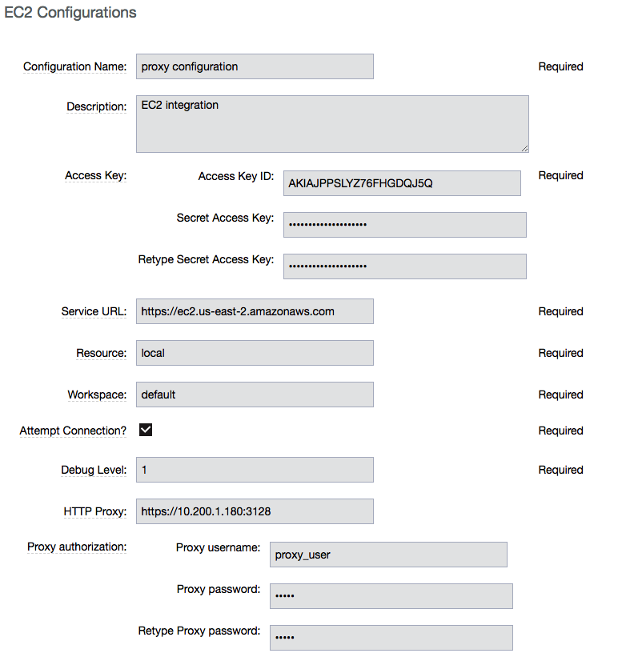

## Output

The EC2 Configurations page now shows the new configuration.

# Plugin procedures

## API\_AllocateIP

This procedure allocates a public IP address using the Amazon EC2 API.
You run this procedure to get an Elastic IP address to use with your EC2
account.

### Input

1.  Go to the API\_AllocateIP procedure.

2.  Enter the following parameters:

<table>
<colgroup>
<col style="width: 50%" />
<col style="width: 50%" />
</colgroup>
<thead>
<tr class="header">
<th style="text-align: left;">Parameter</th>
<th style="text-align: left;">Description</th>
</tr>
</thead>
<tbody>
<tr class="odd">
<td style="text-align: left;">
Configuration
</td>
<td style="text-align: left;">
The name of a valid existing
configuration with the connection information. (Required)
</td>
</tr>
<tr class="even">
<td style="text-align: left;">
Results Location
</td>
<td style="text-align: left;">
Where to put the result. If you do not
enter a location, the result is only printed.
</td>
</tr>
</tbody>
</table>

### Output

## API\_AssociateIP

This procedure attaches a previously allocated IP address to an
instance. This procedure associates an Elastic IP address with the
instance. If the IP address is currently assigned to another instance,
it is re-assigned to the instance.

### Input

1.  Go to the API\_AssociateIP procedure.

2.  Enter the following parameters:

<table>
<colgroup>
<col style="width: 50%" />
<col style="width: 50%" />
</colgroup>
<thead>
<tr class="header">
<th style="text-align: left;">Parameter</th>
<th style="text-align: left;">Description</th>
</tr>
</thead>
<tbody>
<tr class="odd">
<td style="text-align: left;">
Configuration
</td>
<td style="text-align: left;">
The name of a valid existing
configuration with the connection information. (Required)
</td>
</tr>
<tr class="even">
<td style="text-align: left;">
Instance
</td>
<td style="text-align: left;">
The instance to associate with the IP
address. (Required)
</td>
</tr>
<tr class="odd">
<td style="text-align: left;">
Elastic IP
</td>
<td style="text-align: left;">
IP address to assign to the instance.
(Required)
</td>
</tr>
</tbody>
</table>

### Output

## API\_AttachVolumes

This procedure attaches a list of volumes to a list of instances, using
the order of both lists to match volumes to instances. It attaches each
Amazon EBS volume to a running instance and exposes it as the specified
device.

### Input

1.  Go to the API\_AttachVolumes procedure.

2.  Enter the following parameters:

<table>
<colgroup>
<col style="width: 50%" />
<col style="width: 50%" />
</colgroup>
<thead>
<tr class="header">
<th style="text-align: left;">Parameter</th>
<th style="text-align: left;">Description</th>
</tr>
</thead>
<tbody>
<tr class="odd">
<td style="text-align: left;">
Configuration
</td>
<td style="text-align: left;">
The name of a valid existing
configuration with the connection information. (Required)
</td>
</tr>
<tr class="even">
<td style="text-align: left;">
Device
</td>
<td style="text-align: left;">
How the device is exposed to the
instance. The default is <code>/dev/sdh</code>. (Required)
</td>
</tr>
<tr class="odd">
<td style="text-align: left;">
List of Instances
</td>
<td style="text-align: left;">
The instances to which the volumes are
attached. (Required)
</td>
</tr>
<tr class="even">
<td style="text-align: left;">
List of Volumes
</td>
<td style="text-align: left;">
The volumes that are attached to the
instances. (Required)
</td>
</tr>
</tbody>
</table>

### Output

## API\_CreateImage

This procedure converts a running instance into a new image. It creates
an Amazon EBS-backed AMI from an Amazon EBS-backed instance.

### Input

1.  Go to the API\_CreateImage procedure.

2.  Enter the following parameters:

<table>
<colgroup>
<col style="width: 50%" />
<col style="width: 50%" />
</colgroup>
<thead>
<tr class="header">
<th style="text-align: left;">Parameter</th>
<th style="text-align: left;">Description</th>
</tr>
</thead>
<tbody>
<tr class="odd">
<td style="text-align: left;">
Configuration
</td>
<td style="text-align: left;">
The name of a valid existing
configuration with the connection information. (Required)
</td>
</tr>
<tr class="even">
<td style="text-align: left;">
Instance
</td>
<td style="text-align: left;">
The name of the instance to convert.
(Required)
</td>
</tr>
<tr class="odd">
<td style="text-align: left;">
New Image Name
</td>
<td style="text-align: left;">
The name of the new image.
(Required)
</td>
</tr>
<tr class="even">
<td style="text-align: left;">
New Image Description
</td>
<td style="text-align: left;">
The description for the new image.
(Required)
</td>
</tr>
<tr class="odd">
<td style="text-align: left;">
No Reboot
</td>
<td style="text-align: left;">
By default, this parameter is set to
<strong>False</strong>. Amazon EC2 tries to shut down the instance
cleanly before the new image is created. Amazon EC2 then restarts the
new instance with the new image. When the parameter is set to
<strong>True</strong>, Amazon EC2 does not shut down the instance before
creating the image, and the file system integrity on the new image
cannot be guaranteed. (Required)
</td>
</tr>
<tr class="even">
<td style="text-align: left;">
Results Location
</td>
<td style="text-align: left;">
Where to put the result. If you do not
enter a location, the result is only printed. (Required)
</td>
</tr>
</tbody>
</table>

### Output

## API\_CreateKey

This procedure creates a new key pair with the specified name. If a key
with the specified name already exists, Amazon EC2 returns an error. The
public key is stored by Amazon EC2, and the private key file is saved in
the job workspace with read permission for the user running the agent.
The private key file name is the key pair name, with *.pem* as
extension.

**Important:** You should retrieve the private key file from the job
workspace and save it in a secure place. You will need the private key
file in order to connect (using SSH or Windows Remote Desktop) to any
EC2 instance that was launched using the key pair name.

### Input

1.  Go to the API\_CreateKey procedure.

2.  Enter the following parameters:

<table>
<colgroup>
<col style="width: 50%" />
<col style="width: 50%" />
</colgroup>
<thead>
<tr class="header">
<th style="text-align: left;">Parameter</th>
<th style="text-align: left;">Description</th>
</tr>
</thead>
<tbody>
<tr class="odd">
<td style="text-align: left;">
Configuration
</td>
<td style="text-align: left;">
The name of a valid existing
configuration with the connection information. (Required)
</td>
</tr>
<tr class="even">
<td style="text-align: left;">
Key name
</td>
<td style="text-align: left;">
A unique name for the key pair. The
default is <code>cmdr-$[jobStepId]</code>. (Required)
</td>
</tr>
<tr class="odd">
<td style="text-align: left;">
Results Location
</td>
<td style="text-align: left;">
Where to put the result. If the
location is not specified, the result is only printed.
</td>
</tr>
</tbody>
</table>

### Output

## API\_CreateSubnet

This procedure allows you to create a new subnet within Amazon VPC by
specifying its name, CIDR block, VPC ID and availability zone.

### Input

1.  Go to the API\_CreateSubnet procedure.

2.  Enter the following parameters:

<table>
<colgroup>
<col style="width: 50%" />
<col style="width: 50%" />
</colgroup>
<thead>
<tr class="header">
<th style="text-align: left;">Parameter</th>
<th style="text-align: left;">Description</th>
</tr>
</thead>
<tbody>
<tr class="odd">
<td style="text-align: left;">
Configuration
</td>
<td style="text-align: left;">
The name of a valid existing
configuration with the connection information. (Required)
</td>
</tr>
<tr class="even">
<td style="text-align: left;">
Subnet Name
</td>
<td style="text-align: left;">
Name to be given to subnet.
</td>
</tr>
<tr class="odd">
<td style="text-align: left;">
CIDR Block
</td>
<td style="text-align: left;">
The range of IP addresses to use in the
subnet in CIDR format (for example, 10.0.0.0/24). The range of IP
addresses in the subnet must be subset of IP address in the VPC. The
size subnet can equal the size of the VPC. (Required)
</td>
</tr>
<tr class="even">
<td style="text-align: left;">
Availability Zone
</td>
<td style="text-align: left;">
Availability zone where this subnet
will reside. If no preferences are entered, Amazon will choose an
availability zone for you. (Required)
</td>
</tr>
<tr class="odd">
<td style="text-align: left;">
VPC ID
</td>
<td style="text-align: left;">
VPC to use for this subnet.
(Required)
</td>
</tr>
<tr class="even">
<td style="text-align: left;">
Results Location
</td>
<td style="text-align: left;">
Where to put the result. If not
specified, the result is only printed.
</td>
</tr>
</tbody>
</table>

### Output

## API\_CreateTags

This procedure adds or overwrites one or more tags for the specified
Amazon EC2 resources.

### Input

1.  Go to the API\_CreateTags procedure.

2.  Enter the following parameters:

<table>
<colgroup>
<col style="width: 50%" />
<col style="width: 50%" />
</colgroup>
<thead>
<tr class="header">
<th style="text-align: left;">Parameter</th>
<th style="text-align: left;">Description</th>
</tr>
</thead>
<tbody>
<tr class="odd">
<td style="text-align: left;">
Configuration
</td>
<td style="text-align: left;">
The name of a valid existing
configuration with the connection information. (Required)
</td>
</tr>
<tr class="even">
<td style="text-align: left;">
Resources
</td>
<td style="text-align: left;">
A list of resource IDs, separated by
spaces. (Required)
</td>
</tr>
<tr class="odd">
<td style="text-align: left;">
Tags
</td>
<td style="text-align: left;">
A list of key-value pairs, separated by
commas, in this format: key1 ⇒ value1, key2 ⇒ value 2, …
(Required)
</td>
</tr>
</tbody>
</table>

### Output

## API\_CreateVPC

Amazon Virtual Private Cloud (Amazon VPC) lets you provision a logically
isolated section of the Amazon Web Services (AWS) Cloud where you can
launch AWS resources in a virtual network that you define. This
procedure allows you to create a new Amazon VPC by specifying the VPC
name and CIDR block.

### Input

1.  Go to the API\_CreateVPC procedure.

2.  Enter the following parameters:

<table>
<colgroup>
<col style="width: 50%" />
<col style="width: 50%" />
</colgroup>
<thead>
<tr class="header">
<th style="text-align: left;">Parameter</th>
<th style="text-align: left;">Description</th>
</tr>
</thead>
<tbody>
<tr class="odd">
<td style="text-align: left;">
Configuration
</td>
<td style="text-align: left;">
The name of a valid existing
configuration with the connection information. (Required)
</td>
</tr>
<tr class="even">
<td style="text-align: left;">
VPC Name
</td>
<td style="text-align: left;">
Name to be given to VPC.
</td>
</tr>
<tr class="odd">
<td style="text-align: left;">
CIDR Block
</td>
<td style="text-align: left;">
The range of IP addresses to use for
your VPC, in CIDR format, for example,10.0.0.0/24.Block size must be
between a /16 netmask and /28 netmask. (Required)
</td>
</tr>
<tr class="even">
<td style="text-align: left;">
Results Location
</td>
<td style="text-align: left;">
Where to put the result. If not
specified, the result is only printed.
</td>
</tr>
</tbody>
</table>

### Output

## API\_DeleteKey

This procedure deletes the specified key pair by removing the public key
from Amazon EC2. You must own the key pair.

### Input

1.  Go to the API\_DeleteKey procedure.

2.  Enter the following parameters:

<table>
<colgroup>
<col style="width: 50%" />
<col style="width: 50%" />
</colgroup>
<thead>
<tr class="header">
<th style="text-align: left;">Parameter</th>
<th style="text-align: left;">Description</th>
</tr>
</thead>
<tbody>
<tr class="odd">
<td style="text-align: left;">
Configuration
</td>
<td style="text-align: left;">
The name of a valid existing
configuration with the connection information. (Required)
</td>
</tr>
<tr class="even">
<td style="text-align: left;">
Key name
</td>
<td style="text-align: left;">
The name of the key pair to delete. The
default is <code>$[/myJob/Amazon EC2/$[cleanup_tag]/KeyPairId]</code>.
(Required)
</td>
</tr>
</tbody>
</table>

### Output

## API\_DeleteVolume

This procedure deletes an EBS volume. It is usually used to delete a
volume created for a specific instance.

### Input

1.  Go to the API\_DeleteVolume procedure.

2.  Enter the following parameters:

<table>
<colgroup>
<col style="width: 50%" />
<col style="width: 50%" />
</colgroup>
<thead>
<tr class="header">
<th style="text-align: left;">Parameter</th>
<th style="text-align: left;">Description</th>
</tr>
</thead>
<tbody>
<tr class="odd">
<td style="text-align: left;">
Configuration
</td>
<td style="text-align: left;">
The name of a valid existing
configuration with the connection information. (Required)
</td>
</tr>
<tr class="even">
<td style="text-align: left;">
Detach Only?
</td>
<td style="text-align: left;">
If the check box is selected, the
volume is not deleted after it is detached from the instance.
(Required)
</td>
</tr>
<tr class="odd">
<td style="text-align: left;">
Volume
</td>
<td style="text-align: left;">
Name of volume to delete.
</td>
</tr>
</tbody>
</table>

### Output

## API\_DeleteVPC

This procedure allows you to delete the VPC and any subnets created
within it by specifying the VPC ID.

### Input

1.  Go to the API\_DeleteVPC procedure.

2.  Enter the following parameters:

<table>
<colgroup>
<col style="width: 50%" />
<col style="width: 50%" />
</colgroup>
<thead>
<tr class="header">
<th style="text-align: left;">Parameter</th>
<th style="text-align: left;">Description</th>
</tr>
</thead>
<tbody>
<tr class="odd">
<td style="text-align: left;">
Configuration
</td>
<td style="text-align: left;">
The name of a valid existing
configuration with the connection information. (Required)
</td>
</tr>
<tr class="even">
<td style="text-align: left;">
VPC ID
</td>
<td style="text-align: left;">
ID of VPC to delete.
(Required)
</td>
</tr>
<tr class="odd">
<td style="text-align: left;">
Results Location
</td>
<td style="text-align: left;">
Where to put the result. If not
specified, the result is only printed.
</td>
</tr>
</tbody>
</table>

### Output

## API\_DescribeInstances

This procedure adds descriptions to one or more instances.

### Input

1.  Go to the API\_DescribeInstances procedure.

2.  Enter the following parameters:

<table>
<colgroup>
<col style="width: 50%" />
<col style="width: 50%" />
</colgroup>
<thead>
<tr class="header">
<th style="text-align: left;">Parameter</th>
<th style="text-align: left;">Description</th>
</tr>
</thead>
<tbody>
<tr class="odd">
<td style="text-align: left;">
Configuration
</td>
<td style="text-align: left;">
The name of a valid existing
configuration with the connection information. (Required)
</td>
</tr>
<tr class="even">
<td style="text-align: left;">
Instances
</td>
<td style="text-align: left;">
One or more instances. You can specify
one instance, a list of instances separated with semi-colons, or
reservation.
</td>
</tr>
<tr class="odd">
<td style="text-align: left;">
Results Location
</td>
<td style="text-align: left;">
Where to put the result. If the
location is not specified, the result is only printed.
</td>
</tr>
</tbody>
</table>

### Output

## API\_ReleaseIP

This procedure releases a public IP address allocated to your account.

### Input

1.  Go to the API\_ReleaseIP procedure.

2.  Enter the following parameters:

<table>
<colgroup>
<col style="width: 50%" />
<col style="width: 50%" />
</colgroup>
<thead>
<tr class="header">
<th style="text-align: left;">Parameter</th>
<th style="text-align: left;">Description</th>
</tr>
</thead>
<tbody>
<tr class="odd">
<td style="text-align: left;">
Configuration
</td>
<td style="text-align: left;">
The name of a valid existing
configuration with the connection information. (Required)
</td>
</tr>
<tr class="even">
<td style="text-align: left;">
Elastic IP
</td>
<td style="text-align: left;">
The IP address to be released.
(Required)
</td>
</tr>
</tbody>
</table>

### Output

## API\_Run

This procedure runs the specified API method (procedure). Individual API
procedures collect parameter values and call this procedure. Credentials
should be attached to this procedure.

### Input

1.  Go to the API\_Run procedure.

2.  Enter the following parameters:

<table>
<colgroup>
<col style="width: 50%" />
<col style="width: 50%" />
</colgroup>
<thead>
<tr class="header">
<th style="text-align: left;">Parameter</th>
<th style="text-align: left;">Description</th>
</tr>
</thead>
<tbody>
<tr class="odd">
<td style="text-align: left;">
Configuration
</td>
<td style="text-align: left;">
The name of a valid existing
configuration with the connection information. (Required)
</td>
</tr>
<tr class="even">
<td style="text-align: left;">
Method
</td>
<td style="text-align: left;">
The API method (procedure) to run.
(Required)
</td>
</tr>
</tbody>
</table>

### Output

## API\_RunInstances

This procedure allows the user to start one or more instances from a
machine image (AMI/EMI). The instances are part of one reservation and
can be terminated later as a group or individually.

<table>
<colgroup>
<col style="width: 50%" />
<col style="width: 50%" />
</colgroup>
<thead>
<tr class="header">
<th style="text-align: left;">Parameter</th>
<th style="text-align: left;">Description</th>
</tr>
</thead>
<tbody>
<tr class="odd">
<td style="text-align: left;">
Configuration
</td>
<td style="text-align: left;">
The name of the config which holds all
the connection information. This must reference a valid existing
configuration. (Required)
</td>
</tr>
<tr class="even">
<td style="text-align: left;">
Number of Instances
</td>
<td style="text-align: left;">
The number of instances to
start(default is <code>1</code>). (Required)
</td>
</tr>
<tr class="odd">
<td style="text-align: left;">
Security Group
</td>
<td style="text-align: left;">
The security group to use (default is
<code>default</code>).
</td>
</tr>
<tr class="even">
<td style="text-align: left;">
Image
</td>
<td style="text-align: left;">
The name of the EC2 image that you
would like to deploy. (Required)
</td>
</tr>
<tr class="odd">
<td style="text-align: left;">
Instance Type
</td>
<td style="text-align: left;">
The instance type (default is
<code>Small(m1.small)</code>). (Required)

<ul>
<li>
Options:
</li>
<li>
C1 High-CPU Medium (c1.medium)
</li>
<li>
C1 High-CPU Extra Large (c1.xlarge)
</li>
<li>
C3 High-CPU Double Extra Large (c3.2xlarge)
</li>
<li>
C3 High-CPU Quadruple Extra Large (c3.4xlarge)
</li>
<li>
C3 High-CPU Eight Extra Large (c3.8xlarge)
</li>
<li>
C3 High-CPU Large (c3.large)
</li>
<li>
C3 High-CPU Extra Large (c3.xlarge)
</li>
<li>
C4 High-CPU Double Extra Large (c4.2xlarge)
</li>
<li>
C4 High-CPU Quadruple Extra Large (c4.4xlarge)
</li>
<li>
C4 High-CPU Eight Extra Large (c4.8xlarge)
</li>
<li>
C4 High-CPU Large (c4.large)
</li>
<li>
C4 High-CPU Extra Large (c4.xlarge)
</li>
<li>
C5 High-CPU 18xlarge (c5.18xlarge)
</li>
<li>
C5 High-CPU Double Extra Large (c5.2xlarge)
</li>
<li>
C5 High-CPU Quadruple Extra Large (c5.4xlarge)
</li>
<li>
C5 High-CPU 9xlarge (c5.9xlarge)
</li>
<li>
C5 High-CPU Large (c5.large)
</li>
<li>
C5 High-CPU Extra Large (c5.xlarge)
</li>
<li>
C5 High-CPU 18xlarge (c5d.18xlarge)
</li>
<li>
C5 High-CPU Double Extra Large (c5d.2xlarge)
</li>
<li>
C5 High-CPU Quadruple Extra Large (c5d.4xlarge)
</li>
<li>
C5 High-CPU 9xlarge (c5d.9xlarge)
</li>
<li>
C5 High-CPU Large (c5d.large)
</li>
<li>
C5 High-CPU Extra Large (c5d.xlarge)
</li>
<li>
Cluster Compute Quadruple Extra Large (cc1.4xlarge)
</li>
<li>
Cluster Compute Eight Extra Large (cc2.8xlarge)
</li>
<li>
Cluster GPU Quadruple Extra Large (cg1.4xlarge)
</li>
<li>
High Memory Cluster Eight Extra Large (cr1.8xlarge)
</li>
<li>
D2 Double Extra Large (d2.2xlarge)
</li>
<li>
D2 Quadruple Extra Large (d2.4xlarge)
</li>
<li>
D2 Eight Extra Large (d2.8xlarge)
</li>
<li>
D2 Extra Large (d2.xlarge)
</li>
<li>
F1 16xlarge (f1.16xlarge)
</li>
<li>
F1 Double Extra Large (f1.2xlarge)
</li>
<li>
G2 Double Extra Large (g2.2xlarge)
</li>
<li>
G2 Eight Extra Large (g2.8xlarge)
</li>
<li>
G3 16xlarge (g3.16xlarge)
</li>
<li>
G3 Quadruple Extra Large (g3.4xlarge)
</li>
<li>
G3 Eight Extra Large (g3.8xlarge)
</li>
<li>
H1 16xlarge (h1.16xlarge)
</li>
<li>
H1 Double Extra Large (h1.2xlarge)
</li>
<li>
H1 Quadruple Extra Large (h1.4xlarge)
</li>
<li>
H1 Eight Extra Large (h1.8xlarge)
</li>
<li>
High I/O Quadruple Extra Large (hi1.4xlarge)
</li>
<li>
High Storage Eight Extra Large (hs1.8xlarge)
</li>
<li>
I2 Double Extra Large (i2.2xlarge)
</li>
<li>
I2 Quadruple Extra Large (i2.4xlarge)
</li>
<li>
I2 Eight Extra Large (i2.8xlarge)
</li>
<li>
I2 Extra Large (i2.xlarge)
</li>
<li>
I3 High I/O 16xlarge (i3.16xlarge)
</li>
<li>
I3 High I/O Double Extra Large (i3.2xlarge)
</li>
<li>
I3 High I/O Quadruple Extra Large (i3.4xlarge)
</li>
<li>
I3 High I/O Eight Extra Large (i3.8xlarge)
</li>
<li>
I3 High I/O Large (i3.large)
</li>
<li>
I3 High I/O Metal (i3.metal)
</li>
<li>
I3 High I/O Extra Large (i3.xlarge)
</li>
<li>
M1 General Purpose Large (m1.large)
</li>
<li>
M1 General Purpose Medium (m1.medium)
</li>
<li>
M1 General Purpose Small (m1.small)
</li>
<li>
M1 General Purpose Extra Large (m1.xlarge)
</li>
<li>
M2 High Memory Double Extra Large (m2.2xlarge)
</li>
<li>
M2 High Memory Quadruple Extra Large (m2.4xlarge)
</li>
<li>
M2 High Memory Extra Large (m2.xlarge)
</li>
<li>
M3 General Purpose Double Extra Large (m3.2xlarge)
</li>
<li>
M3 General Purpose Large (m3.large)
</li>
<li>
M3 General Purpose Medium (m3.medium)
</li>
<li>
M3 General Purpose Extra Large (m3.xlarge)
</li>
<li>
M4 General Purpose Deca Extra Large (m4.10xlarge)
</li>
<li>
M4 General Purpose 16xlarge (m4.16xlarge)
</li>
<li>
M4 General Purpose Double Extra Large (m4.2xlarge)
</li>
<li>
M4 General Purpose Quadruple Extra Large (m4.4xlarge)
</li>
<li>
M4 General Purpose Large (m4.large)
</li>
<li>
M4 General Purpose Extra Large (m4.xlarge)
</li>
<li>
M5 General Purpose 12xlarge (m5.12xlarge)
</li>
<li>
M5 General Purpose 24xlarge (m5.24xlarge)
</li>
<li>
M5 General Purpose Double Extra Large (m5.2xlarge)
</li>
<li>
M5 General Purpose Quadruple Extra Large (m5.4xlarge)
</li>
<li>
M5 General Purpose Large (m5.large)
</li>
<li>
M5 General Purpose Extra Large (m5.xlarge)
</li>
<li>
M5 General Purpose 12xlarge (m5d.12xlarge)
</li>
<li>
M5 General Purpose 24xlarge (m5d.24xlarge)
</li>
<li>
M5 General Purpose Double Extra Large (m5d.2xlarge)
</li>
<li>
M5 General Purpose Quadruple Extra Large (m5d.4xlarge)
</li>
<li>
M5 General Purpose Large (m5d.large)
</li>
<li>
M5 General Purpose Extra Large (m5d.xlarge)
</li>
<li>
General Purpose GPU 16xlarge (p2.16xlarge)
</li>
<li>
General Purpose GPU Eight Extra Large (p2.8xlarge)
</li>
<li>
General Purpose GPU Extra Large (p2.xlarge)
</li>
<li>
P3 16xlarge (p3.16xlarge)
</li>
<li>
P3 Double Extra Large (p3.2xlarge)
</li>
<li>
P3 Eight Extra Large (p3.8xlarge)
</li>
<li>
R3 High-Memory Double Extra Large (r3.2xlarge)
</li>
<li>
R3 High-Memory Quadruple Extra Large (r3.4xlarge)
</li>
<li>
R3 High-Memory Eight Extra Large (r3.8xlarge)
</li>
<li>
R3 High-Memory Large (r3.large)
</li>
<li>
R3 High-Memory Extra Large (r3.xlarge)
</li>
<li>
R4 High-Memory 16xlarge (r4.16xlarge)
</li>
<li>
R4 High-Memory Double Extra Large (r4.2xlarge)
</li>
<li>
R4 High-Memory Quadruple Extra Large (r4.4xlarge)
</li>
<li>
R4 High-Memory Eight Extra Large (r4.8xlarge)
</li>
<li>
R4 High-Memory Large (r4.large)
</li>
<li>
R4 High-Memory Extra Large (r4.xlarge)
</li>
<li>
R5 12xlarge (r5.12xlarge)
</li>
<li>
R5 16xlarge (r5.16xlarge)
</li>
<li>
R5 24xlarge (r5.24xlarge)
</li>
<li>
R5 Double Extra Large (r5.2xlarge)
</li>
<li>
R5 Quadruple Extra Large (r5.4xlarge)
</li>
<li>
R5 Eight Extra Large (r5.8xlarge)
</li>
<li>
R5 Large (r5.large)
</li>
<li>
R5 Metal (r5.metal)
</li>
<li>
R5 Extra Large (r5.xlarge)
</li>
<li>
R5D 12xlarge (r5d.12xlarge)
</li>
<li>
R5D 16xlarge (r5d.16xlarge)
</li>
<li>
R5D 24xlarge (r5d.24xlarge)
</li>
<li>
R5D Double Extra Large (r5d.2xlarge)
</li>
<li>
R5D Quadruple Extra Large (r5d.4xlarge)
</li>
<li>
R5D Eight Extra Large (r5d.8xlarge)
</li>
<li>
R5D Large (r5d.large)
</li>
<li>
R5D Metal (r5d.metal)
</li>
<li>
R5D Extra Large (r5d.xlarge)
</li>
<li>
T1 Micro (t1.micro)
</li>
<li>
T2 Double Extra Large (t2.2xlarge)
</li>
<li>
T2 Large (t2.large)
</li>
<li>
T2 Medium (t2.medium)
</li>
<li>
T2 Micro (t2.micro)
</li>
<li>
T2 Nano (t2.nano)
</li>
<li>
T2 Small (t2.small)
</li>
<li>
T2 Extra Large (t2.xlarge)
</li>
<li>
X1 Extra High-Memory 16xlarge (x1.16xlarge)
</li>
<li>
X1 Extra High-Memory 32xlarge (x1.32xlarge)
</li>
<li>
X1E 16xlarge (x1e.16xlarge)
</li>
<li>
X1E Double Extra Large (x1e.2xlarge)
</li>
<li>
X1E 32xlarge (x1e.32xlarge)
</li>
<li>
X1E Quadruple Extra Large (x1e.4xlarge)
</li>
<li>
X1E Eight Extra Large (x1e.8xlarge)
</li>
<li>
X1E Extra Large (x1e.xlarge)
</li>
<li>
Z1D 12xlarge (z1d.12xlarge)
</li>
<li>
Z1D Double Extra Large (z1d.2xlarge)
</li>
<li>
Z1D 3xlarge (z1d.3xlarge)
</li>
<li>
Z1D 6xlarge (z1d.6xlarge)
</li>
<li>
Z1D Large (z1d.large)
</li>
<li>
Z1D Extra Large (z1d.xlarge)
</li>
</ul></td>
</tr>
<tr class="even">
<td style="text-align: left;">
Key name
</td>
<td style="text-align: left;">
The name of the key pair to use.
(Required)
</td>
</tr>
<tr class="odd">
<td style="text-align: left;">
Results Location
</td>
<td style="text-align: left;">
Where to put the result. If not
specified, the result is only printed.
</td>
</tr>
<tr class="even">
<td style="text-align: left;">
User Data
</td>
<td style="text-align: left;">
Extra user data to pass to
runInstance.
</td>
</tr>
<tr class="odd">
<td style="text-align: left;">
Availability Zone
</td>
<td style="text-align: left;">
The Availability Zone you want to
launch the instance into. (Required)
</td>
</tr>
<tr class="even">
<td style="text-align: left;">
Subnet Id
</td>
<td style="text-align: left;">
The ID of the subnet to launch the
instance(s) into (for use with VPCs)
</td>
</tr>
<tr class="odd">
<td style="text-align: left;">
Private IP
</td>
<td style="text-align: left;">
The primary IP address. You must
specify a value from the IP address range of the subnet. If no value is
entered, an IP address from the IP address range of the subnet is
selected to use with theVPCs.
</td>
</tr>
<tr class="even">
<td style="text-align: left;">
Use Private IP for subnet?
</td>
<td style="text-align: left;">
If selected, a private IP address is
used to create the resource.
</td>
</tr>
<tr class="odd">
<td style="text-align: left;">
Instance Initiated Shutdown
Behavior
</td>
<td style="text-align: left;">
Specify the instance behaviour when an
OS-level shutdown is performed. The instance can be either terminated or
shut down.
</td>
</tr>
<tr class="even">
<td style="text-align: left;">
Tenancy
</td>
<td style="text-align: left;">
Each instance that you launch into a
VPC has a tenancy attribute. This attribute has the following
values:

default - Your instance runs on shared hardware.

dedicated - Your instance runs on single-tenant hardware.

host - Your instance runs on a Dedicated Host, which is an isolated
server with configurations that you can control.
</td>
</tr>
<tr class="odd">
<td style="text-align: left;">
IAM Profile Name
</td>
<td style="text-align: left;">
Specify an IAM profile you want this
instance to be associated with. If this parameter is not specified,
instance will not be associated with a profile.
</td>
</tr>
<tr class="even">
<td style="text-align: left;">
Resource Pool
</td>
<td style="text-align: left;"></td>
</tr>
<tr class="odd">
<td style="text-align: left;"></td>
<td style="text-align: left;">
If you specify a resource poolName in
res_poolName, this is the workspace that will be used when creating the
resource.
</td>
</tr>
<tr class="even">
<td style="text-align: left;">
Resource port
</td>
<td style="text-align: left;">
If you specify a resource poolName in
res_poolName, this is the port that will be used when creating the
resource.
</td>
</tr>
</tbody>
</table>

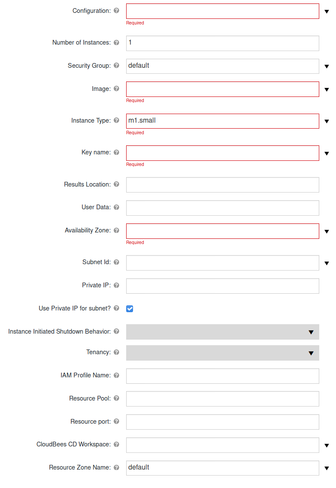

## API\_UpdateInstances

Updates one or more attribute values of an Instance. Where required the
procedure can be used to update attribute values of multiple instances.

<table>
<colgroup>
<col style="width: 50%" />
<col style="width: 50%" />
</colgroup>
<thead>
<tr class="header">
<th style="text-align: left;">Parameter</th>
<th style="text-align: left;">Description</th>
</tr>
</thead>
<tbody>
<tr class="odd">
<td style="text-align: left;">
Configuration
</td>
<td style="text-align: left;">
The name of the config which holds all
the connection information. This must reference a valid existing
configuration. (Required)
</td>
</tr>
<tr class="even">
<td style="text-align: left;">
Instance IDs
</td>
<td style="text-align: left;">
Comma-separated list of Instance IDs to
update, e.g. i-00901da83f8647e57.
</td>
</tr>
<tr class="odd">
<td style="text-align: left;">
Security Group Id
</td>
<td style="text-align: left;">
New security group to use for updated
instances, e.g. sg-79894433. If this field is left empty, the security
group will not be updated.
</td>
</tr>
<tr class="even">
<td style="text-align: left;">
Instance Type
</td>
<td style="text-align: left;">
New instance type.
<strong>Note</strong>: to update instance type, the instance must be
stopped and started again.
</td>
</tr>
<tr class="odd">
<td style="text-align: left;">
User Data
</td>
<td style="text-align: left;">
Extra user data to pass to runInstance.
Note: to update User Data, the instance will be stopped and started
again.
</td>
</tr>
<tr class="even">
<td style="text-align: left;">
Instance Initiated Shutdown
Behavior
</td>
<td style="text-align: left;">
Specify the instance behaviour when an
OS-level shutdown is performed. Instance can be either terminated or
shut down.
</td>
</tr>
</tbody>
</table>

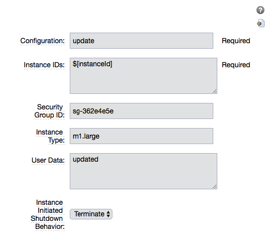

## API\_StartInstance

This procedure deploys an Amazon EBS-backed instance.

### Input

1.  Go to the API\_StartInstance procedure.

2.  Enter the following parameters:

<table>
<colgroup>
<col style="width: 50%" />
<col style="width: 50%" />
</colgroup>
<thead>
<tr class="header">
<th style="text-align: left;">Parameter</th>
<th style="text-align: left;">Description</th>
</tr>
</thead>
<tbody>
<tr class="odd">
<td style="text-align: left;">
Configuration
</td>
<td style="text-align: left;">
The name of a valid existing
configuration with the connection information. (Required)
</td>
</tr>
<tr class="even">
<td style="text-align: left;">
Instance name
</td>
<td style="text-align: left;">
The name of the EC2 instance to deploy.
(Required)
</td>
</tr>
</tbody>
</table>

### Output

## API\_StopInstance

This procedure stops an Amazon EBS-backed instance. Data is not be lost
when the instance stops.

## Input

1.  Go to the API\_StartInstance procedure.

2.  Enter the following parameters:

<table>
<colgroup>
<col style="width: 50%" />
<col style="width: 50%" />
</colgroup>
<thead>
<tr class="header">
<th style="text-align: left;">Parameter</th>
<th style="text-align: left;">Description</th>
</tr>
</thead>
<tbody>
<tr class="odd">
<td style="text-align: left;">
Configuration
</td>
<td style="text-align: left;">
The name of a valid existing
configuration with the connection information. (Required)
</td>
</tr>
<tr class="even">
<td style="text-align: left;">
Instance id
</td>
<td style="text-align: left;">
The ID of the Amazon EC2 instance to
stop. (Required)
</td>
</tr>
</tbody>
</table>

## Output

## API\_TearDownResource

This procedure terminate one instance. When the procedure terminates,
any data added to the disk or any changes made to the disk will be lost.

### Input

1.  Go to the API\_TearDownResource procedure.

2.  Enter the following parameters:

<table>
<colgroup>
<col style="width: 50%" />
<col style="width: 50%" />
</colgroup>
<thead>
<tr class="header">
<th style="text-align: left;">Parameter</th>
<th style="text-align: left;">Description</th>
</tr>
</thead>
<tbody>
<tr class="odd">
<td style="text-align: left;">
Configuration
</td>
<td style="text-align: left;">
The name of a valid existing
configuration with the connection information.
</td>
</tr>
<tr class="even">
<td style="text-align: left;">
Resource Name
</td>
<td style="text-align: left;">
The name of the cloud resource to tear
down. This procedure works only on a resource that was created in a
dynamic environment. (Required)
</td>
</tr>
</tbody>
</table>

### Output

## API\_Terminate

This procedure terminate one or more instances. When the procedures
terminates any data added to the disk or any changes made to the disk
will be lost.

### Input

1.  Go to the API\_Terminate procedure.

2.  Enter the following parameters:

<table>
<colgroup>
<col style="width: 50%" />
<col style="width: 50%" />
</colgroup>
<thead>
<tr class="header">
<th style="text-align: left;">Parameter</th>
<th style="text-align: left;">Description</th>
</tr>
</thead>
<tbody>
<tr class="odd">
<td style="text-align: left;">
Configuration
</td>
<td style="text-align: left;">
The name of a valid existing
configuration with the connection information. (Required)
</td>
</tr>
<tr class="even">
<td style="text-align: left;">
Instance
</td>
<td style="text-align: left;">
Reservation Id
</td>
</tr>
<tr class="odd">
<td style="text-align: left;">
If parameter value is an instance ID,
terminate the specific instance. If it is a reservation ID, terminate
all the instances in the reservation. (Required)
</td>
<td style="text-align: left;">
List of Resources
</td>
</tr>
</tbody>
</table>

### Output

## CloudManagerGrow

This procedure allows this plugin to work with CloudManager plugin.
CloudManager runs this procedure to add servers and calls the *EC2 Auto
Deploy* procedure.

### Input

1.  Go to the CloudManagerGrow procedure.

2.  Enter the following parameters:

<table>
<colgroup>
<col style="width: 50%" />
<col style="width: 50%" />
</colgroup>
<thead>
<tr class="header">
<th style="text-align: left;">Parameter</th>
<th style="text-align: left;">Description</th>
</tr>
</thead>
<tbody>
<tr class="odd">
<td style="text-align: left;">
Configuration
</td>
<td style="text-align: left;">
The name of the configuration with all
the EC-EC2 connection information. (Required)
</td>
</tr>
<tr class="even">
<td style="text-align: left;">
Security Group
</td>
<td style="text-align: left;">
The EC2 security group for the new
instances. The default is <code>default</code>. (Required)
</td>
</tr>
<tr class="odd">
<td style="text-align: left;">
Image Name
</td>
<td style="text-align: left;">
The AMI or EMI image to use.
(Required)
</td>
</tr>
<tr class="even">
<td style="text-align: left;">
Device
</td>
<td style="text-align: left;">
The OS device to which the snapshot is
connected when a snapshot is specified.
</td>
</tr>
<tr class="odd">
<td style="text-align: left;">
Instance Type
</td>
<td style="text-align: left;">
The EC2 instance type to create. The
default is <code>Small(m1.small)</code>. (Required)

<ul>
<li>
Options:
</li>
<li>
C1 High-CPU Medium (c1.medium)
</li>
<li>
C1 High-CPU Extra Large (c1.xlarge)
</li>
<li>
C3 High-CPU Double Extra Large (c3.2xlarge)
</li>
<li>
C3 High-CPU Quadruple Extra Large (c3.4xlarge)
</li>
<li>
C3 High-CPU Eight Extra Large (c3.8xlarge)
</li>
<li>
C3 High-CPU Large (c3.large)
</li>
<li>
C3 High-CPU Extra Large (c3.xlarge)
</li>
<li>
C4 High-CPU Double Extra Large (c4.2xlarge)
</li>
<li>
C4 High-CPU Quadruple Extra Large (c4.4xlarge)
</li>
<li>
C4 High-CPU Eight Extra Large (c4.8xlarge)
</li>
<li>
C4 High-CPU Large (c4.large)
</li>
<li>
C4 High-CPU Extra Large (c4.xlarge)
</li>
<li>
C5 High-CPU 18xlarge (c5.18xlarge)
</li>
<li>
C5 High-CPU Double Extra Large (c5.2xlarge)
</li>
<li>
C5 High-CPU Quadruple Extra Large (c5.4xlarge)
</li>
<li>
C5 High-CPU 9xlarge (c5.9xlarge)
</li>
<li>
C5 High-CPU Large (c5.large)
</li>
<li>
C5 High-CPU Extra Large (c5.xlarge)
</li>
<li>
C5 High-CPU 18xlarge (c5d.18xlarge)
</li>
<li>
C5 High-CPU Double Extra Large (c5d.2xlarge)
</li>
<li>
C5 High-CPU Quadruple Extra Large (c5d.4xlarge)
</li>
<li>
C5 High-CPU 9xlarge (c5d.9xlarge)
</li>
<li>
C5 High-CPU Large (c5d.large)
</li>
<li>
C5 High-CPU Extra Large (c5d.xlarge)
</li>
<li>
Cluster Compute Quadruple Extra Large (cc1.4xlarge)
</li>
<li>
Cluster Compute Eight Extra Large (cc2.8xlarge)
</li>
<li>
Cluster GPU Quadruple Extra Large (cg1.4xlarge)
</li>
<li>
High Memory Cluster Eight Extra Large (cr1.8xlarge)
</li>
<li>
D2 Double Extra Large (d2.2xlarge)
</li>
<li>
D2 Quadruple Extra Large (d2.4xlarge)
</li>
<li>
D2 Eight Extra Large (d2.8xlarge)
</li>
<li>
D2 Extra Large (d2.xlarge)
</li>
<li>
F1 16xlarge (f1.16xlarge)
</li>
<li>
F1 Double Extra Large (f1.2xlarge)
</li>
<li>
G2 Double Extra Large (g2.2xlarge)
</li>
<li>
G2 Eight Extra Large (g2.8xlarge)
</li>
<li>
G3 16xlarge (g3.16xlarge)
</li>
<li>
G3 Quadruple Extra Large (g3.4xlarge)
</li>
<li>
G3 Eight Extra Large (g3.8xlarge)
</li>
<li>
H1 16xlarge (h1.16xlarge)
</li>
<li>
H1 Double Extra Large (h1.2xlarge)
</li>
<li>
H1 Quadruple Extra Large (h1.4xlarge)
</li>
<li>
H1 Eight Extra Large (h1.8xlarge)
</li>
<li>
High I/O Quadruple Extra Large (hi1.4xlarge)
</li>
<li>
High Storage Eight Extra Large (hs1.8xlarge)
</li>
<li>
I2 Double Extra Large (i2.2xlarge)
</li>
<li>
I2 Quadruple Extra Large (i2.4xlarge)
</li>
<li>
I2 Eight Extra Large (i2.8xlarge)
</li>
<li>
I2 Extra Large (i2.xlarge)
</li>
<li>
I3 High I/O 16xlarge (i3.16xlarge)
</li>
<li>
I3 High I/O Double Extra Large (i3.2xlarge)
</li>
<li>
I3 High I/O Quadruple Extra Large (i3.4xlarge)
</li>
<li>
I3 High I/O Eight Extra Large (i3.8xlarge)
</li>
<li>
I3 High I/O Large (i3.large)
</li>
<li>
I3 High I/O Metal (i3.metal)
</li>
<li>
I3 High I/O Extra Large (i3.xlarge)
</li>
<li>
M1 General Purpose Large (m1.large)
</li>
<li>
M1 General Purpose Medium (m1.medium)
</li>
<li>
M1 General Purpose Small (m1.small)
</li>
<li>
M1 General Purpose Extra Large (m1.xlarge)
</li>
<li>
M2 High Memory Double Extra Large (m2.2xlarge)
</li>
<li>
M2 High Memory Quadruple Extra Large (m2.4xlarge)
</li>
<li>
M2 High Memory Extra Large (m2.xlarge)
</li>
<li>
M3 General Purpose Double Extra Large (m3.2xlarge)
</li>
<li>
M3 General Purpose Large (m3.large)
</li>
<li>
M3 General Purpose Medium (m3.medium)
</li>
<li>
M3 General Purpose Extra Large (m3.xlarge)
</li>
<li>
M4 General Purpose Deca Extra Large (m4.10xlarge)
</li>
<li>
M4 General Purpose 16xlarge (m4.16xlarge)
</li>
<li>
M4 General Purpose Double Extra Large (m4.2xlarge)
</li>
<li>
M4 General Purpose Quadruple Extra Large (m4.4xlarge)
</li>
<li>
M4 General Purpose Large (m4.large)
</li>
<li>
M4 General Purpose Extra Large (m4.xlarge)
</li>
<li>
M5 General Purpose 12xlarge (m5.12xlarge)
</li>
<li>
M5 General Purpose 24xlarge (m5.24xlarge)
</li>
<li>
M5 General Purpose Double Extra Large (m5.2xlarge)
</li>
<li>
M5 General Purpose Quadruple Extra Large (m5.4xlarge)
</li>
<li>
M5 General Purpose Large (m5.large)
</li>
<li>
M5 General Purpose Extra Large (m5.xlarge)
</li>
<li>
M5 General Purpose 12xlarge (m5d.12xlarge)
</li>
<li>
M5 General Purpose 24xlarge (m5d.24xlarge)
</li>
<li>
M5 General Purpose Double Extra Large (m5d.2xlarge)
</li>
<li>
M5 General Purpose Quadruple Extra Large (m5d.4xlarge)
</li>
<li>
M5 General Purpose Large (m5d.large)
</li>
<li>
M5 General Purpose Extra Large (m5d.xlarge)
</li>
<li>
General Purpose GPU 16xlarge (p2.16xlarge)
</li>
<li>
General Purpose GPU Eight Extra Large (p2.8xlarge)
</li>
<li>
General Purpose GPU Extra Large (p2.xlarge)
</li>
<li>
P3 16xlarge (p3.16xlarge)
</li>
<li>
P3 Double Extra Large (p3.2xlarge)
</li>
<li>
P3 Eight Extra Large (p3.8xlarge)
</li>
<li>
R3 High-Memory Double Extra Large (r3.2xlarge)
</li>
<li>
R3 High-Memory Quadruple Extra Large (r3.4xlarge)
</li>
<li>
R3 High-Memory Eight Extra Large (r3.8xlarge)
</li>
<li>
R3 High-Memory Large (r3.large)
</li>
<li>
R3 High-Memory Extra Large (r3.xlarge)
</li>
<li>
R4 High-Memory 16xlarge (r4.16xlarge)
</li>
<li>
R4 High-Memory Double Extra Large (r4.2xlarge)
</li>
<li>
R4 High-Memory Quadruple Extra Large (r4.4xlarge)
</li>
<li>
R4 High-Memory Eight Extra Large (r4.8xlarge)
</li>
<li>
R4 High-Memory Large (r4.large)
</li>
<li>
R4 High-Memory Extra Large (r4.xlarge)
</li>
<li>
R5 12xlarge (r5.12xlarge)
</li>
<li>
R5 16xlarge (r5.16xlarge)
</li>
<li>
R5 24xlarge (r5.24xlarge)
</li>
<li>
R5 Double Extra Large (r5.2xlarge)
</li>
<li>
R5 Quadruple Extra Large (r5.4xlarge)
</li>
<li>
R5 Eight Extra Large (r5.8xlarge)
</li>
<li>
R5 Large (r5.large)
</li>
<li>
R5 Metal (r5.metal)
</li>
<li>
R5 Extra Large (r5.xlarge)
</li>
<li>
R5D 12xlarge (r5d.12xlarge)
</li>
<li>
R5D 16xlarge (r5d.16xlarge)
</li>
<li>
R5D 24xlarge (r5d.24xlarge)
</li>
<li>
R5D Double Extra Large (r5d.2xlarge)
</li>
<li>
R5D Quadruple Extra Large (r5d.4xlarge)
</li>
<li>
R5D Eight Extra Large (r5d.8xlarge)
</li>
<li>
R5D Large (r5d.large)
</li>
<li>
R5D Metal (r5d.metal)
</li>
<li>
R5D Extra Large (r5d.xlarge)
</li>
<li>
T1 Micro (t1.micro)
</li>
<li>
T2 Double Extra Large (t2.2xlarge)
</li>
<li>
T2 Large (t2.large)
</li>
<li>
T2 Medium (t2.medium)
</li>
<li>
T2 Micro (t2.micro)
</li>
<li>
T2 Nano (t2.nano)
</li>
<li>
T2 Small (t2.small)
</li>
<li>
T2 Extra Large (t2.xlarge)
</li>
<li>
X1 Extra High-Memory 16xlarge (x1.16xlarge)
</li>
<li>
X1 Extra High-Memory 32xlarge (x1.32xlarge)
</li>
<li>
X1E 16xlarge (x1e.16xlarge)
</li>
<li>
X1E Double Extra Large (x1e.2xlarge)
</li>
<li>
X1E 32xlarge (x1e.32xlarge)
</li>
<li>
X1E Quadruple Extra Large (x1e.4xlarge)
</li>
<li>
X1E Eight Extra Large (x1e.8xlarge)
</li>
<li>
X1E Extra Large (x1e.xlarge)
</li>
<li>
Z1D 12xlarge (z1d.12xlarge)
</li>
<li>
Z1D Double Extra Large (z1d.2xlarge)
</li>
<li>
Z1D 3xlarge (z1d.3xlarge)
</li>
<li>
Z1D 6xlarge (z1d.6xlarge)
</li>
<li>
Z1D Large (z1d.large)
</li>
<li>
Z1D Extra Large (z1d.xlarge)
</li>
</ul></td>
</tr>
<tr class="even">
<td style="text-align: left;">
User Data
</td>
<td style="text-align: left;">
Data to pass to the instance.
</td>
</tr>
<tr class="odd">
<td style="text-align: left;">
Snapshot
</td>
<td style="text-align: left;">
An Amazon EC2 snapshot. If a snapshot
is specified, a new volume is created from the snapshot and attached to
the running instance.
</td>
</tr>
<tr class="even">
<td style="text-align: left;">
Zone
</td>
<td style="text-align: left;">
The Availability Zone where the
instance is launched. The default is <code>us-east-1b</code>.
(Required)
</td>
</tr>
<tr class="odd">
<td style="text-align: left;">
Resource Pool
</td>
<td style="text-align: left;">
Pool name for resources.
(Required)
</td>
</tr>
<tr class="even">
<td style="text-align: left;">
Number of new instances
</td>
<td style="text-align: left;">
The number of new servers.
(Required)
</td>
</tr>
</tbody>
</table>

### Output

## CloudManagerShrink

This procedure allows the plugin to work with CloudManager plugin.
CloudManager runs this procedure to remove servers and calls the EC2
Auto Cleanup procedure.

### Input

1.  Go to the CloudManagerShrink procedure.

2.  Enter the following parameters:

<table>
<colgroup>
<col style="width: 50%" />
<col style="width: 50%" />
</colgroup>
<thead>
<tr class="header">
<th style="text-align: left;">Parameter</th>
<th style="text-align: left;">Description</th>
</tr>
</thead>
<tbody>
<tr class="odd">
<td style="text-align: left;">
Configuration
</td>
<td style="text-align: left;">
The name of a valid existing
configuration with the connection information. (Required)
</td>
</tr>
<tr class="even">
<td style="text-align: left;">
List of Deployments
</td>
<td style="text-align: left;">
A list of deployments (previously
created by the CloudManagerGrow procedure) to stop. (Required)
</td>
</tr>
</tbody>
</table>

### Output

## CloudManagerSync

This procedure allows the plugin to work with CloudManager plugin.
CloudManager runs this procedure to synchronize the servers.

### Input

1.  Go to the CloudManagerSync procedure.

2.  Enter the following parameters:

<table>
<colgroup>
<col style="width: 50%" />
<col style="width: 50%" />
</colgroup>
<thead>
<tr class="header">
<th style="text-align: left;">Parameter</th>
<th style="text-align: left;">Description</th>
</tr>
</thead>
<tbody>
<tr class="odd">
<td style="text-align: left;">
Configuration
</td>
<td style="text-align: left;">
The name of a valid existing
configuration with the connection information. (Required)
</td>
</tr>
<tr class="even">
<td style="text-align: left;">
List of Deployments
</td>
<td style="text-align: left;">
A list of deployments.
(Required)
</td>
</tr>
</tbody>
</table>

### Output

## EC2 auto cleanup

This procedure cleans up the instances created with the "EC2 Auto
Deploy" procedure. It uses the API\_DeleteKey, API\_Terminate, and
API\_DeleteVolume procedures to delete the key pair, storage, Elastic
IP, and security settings.

### Input

1.  Go to the EC2 Auto Cleanup procedure.

2.  Enter the following parameters:

<table>
<colgroup>
<col style="width: 50%" />
<col style="width: 50%" />
</colgroup>
<thead>
<tr class="header">
<th style="text-align: left;">Parameter</th>
<th style="text-align: left;">Description =</th>
</tr>
</thead>
<tbody>
<tr class="odd">
<td style="text-align: left;">
Configuration
</td>
<td style="text-align: left;">
The name of a valid existing
configuration with the connection information. (Required)
</td>
</tr>
<tr class="even">
<td style="text-align: left;">
Key name
</td>
<td style="text-align: left;">
Name of the key pair to delete.
(Required)
</td>
</tr>
<tr class="odd">
<td style="text-align: left;">
Reservation Id
</td>
<td style="text-align: left;">
The reservation ID. All instances in
the reservation will be deleted. (Required).
</td>
</tr>
<tr class="even">
<td style="text-align: left;">
List of Volumes
</td>
<td style="text-align: left;">
The names of volumes to delete. The
volumne IDs are separated by semi-colons.
</td>
</tr>
<tr class="odd">
<td style="text-align: left;">
List of Resources
</td>
<td style="text-align: left;"></td>
</tr>
</tbody>
</table>

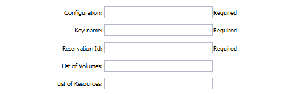

### Output

## EC2 auto deploy

This procedure depoy new EC2 instances. It calls the API\_CreateKey,
API\_RunInstances, ProcessVolumes, and API\_AttachVolumes procedures to
automatically create and associate the key pair, storage, Elastic IP,
and security settings.

### Input

1.  Go to the EC2 Auto Deploy procedure.

2.  Enter the following parameters:

<table>
<colgroup>
<col style="width: 50%" />
<col style="width: 50%" />
</colgroup>
<thead>
<tr class="header">
<th style="text-align: left;">Parameter</th>
<th style="text-align: left;">Description</th>
</tr>
</thead>
<tbody>
<tr class="odd">
<td style="text-align: left;">
Cleanup tag
</td>
<td style="text-align: left;">
A key used to match a cleanup step to
the corresponding provision step. This allows recursive, multiple, or
both recursive and multiple calls calls within a procedure. The default
is <code>tag</code>. (Required)
</td>
</tr>
<tr class="even">
<td style="text-align: left;">
Configuration
</td>
<td style="text-align: left;">
The name of a valid existing
configuration with the connection information. (Required)
</td>
</tr>
<tr class="odd">
<td style="text-align: left;">
Number of Instances
</td>
<td style="text-align: left;">
The number of instances to
automatically deploy. (Required)
</td>
</tr>
<tr class="even">
<td style="text-align: left;">
EC2 AMI
</td>
<td style="text-align: left;">
The name of the Amazon EC2 instance to
deploy. (Required)
</td>
</tr>
<tr class="odd">
<td style="text-align: left;">
Group
</td>
<td style="text-align: left;">
The security group to use. The default
is <code>defaul</code>. (Required)
</td>
</tr>
<tr class="even">
<td style="text-align: left;">
Instance Type
</td>
<td style="text-align: left;">
The instance type. The default is
<code>Large(m1.large)</code>. (Required)

<ul>
<li>
Options:
</li>
<li>
C1 High-CPU Medium (c1.medium)
</li>
<li>
C1 High-CPU Extra Large (c1.xlarge)
</li>
<li>
C3 High-CPU Double Extra Large (c3.2xlarge)
</li>
<li>
C3 High-CPU Quadruple Extra Large (c3.4xlarge)
</li>
<li>
C3 High-CPU Eight Extra Large (c3.8xlarge)
</li>
<li>
C3 High-CPU Large (c3.large)
</li>
<li>
C3 High-CPU Extra Large (c3.xlarge)
</li>
<li>
C4 High-CPU Double Extra Large (c4.2xlarge)
</li>
<li>
C4 High-CPU Quadruple Extra Large (c4.4xlarge)
</li>
<li>
C4 High-CPU Eight Extra Large (c4.8xlarge)
</li>
<li>
C4 High-CPU Large (c4.large)
</li>
<li>
C4 High-CPU Extra Large (c4.xlarge)
</li>
<li>
C5 High-CPU 18xlarge (c5.18xlarge)
</li>
<li>
C5 High-CPU Double Extra Large (c5.2xlarge)
</li>
<li>
C5 High-CPU Quadruple Extra Large (c5.4xlarge)
</li>
<li>
C5 High-CPU 9xlarge (c5.9xlarge)
</li>
<li>
C5 High-CPU Large (c5.large)
</li>
<li>
C5 High-CPU Extra Large (c5.xlarge)
</li>
<li>
C5 High-CPU 18xlarge (c5d.18xlarge)
</li>
<li>
C5 High-CPU Double Extra Large (c5d.2xlarge)
</li>
<li>
C5 High-CPU Quadruple Extra Large (c5d.4xlarge)
</li>
<li>
C5 High-CPU 9xlarge (c5d.9xlarge)
</li>
<li>
C5 High-CPU Large (c5d.large)
</li>
<li>
C5 High-CPU Extra Large (c5d.xlarge)
</li>
<li>
Cluster Compute Quadruple Extra Large (cc1.4xlarge)
</li>
<li>
Cluster Compute Eight Extra Large (cc2.8xlarge)
</li>
<li>
Cluster GPU Quadruple Extra Large (cg1.4xlarge)
</li>
<li>
High Memory Cluster Eight Extra Large (cr1.8xlarge)
</li>
<li>
D2 Double Extra Large (d2.2xlarge)
</li>
<li>
D2 Quadruple Extra Large (d2.4xlarge)
</li>
<li>
D2 Eight Extra Large (d2.8xlarge)
</li>
<li>
D2 Extra Large (d2.xlarge)
</li>
<li>
F1 16xlarge (f1.16xlarge)
</li>
<li>
F1 Double Extra Large (f1.2xlarge)
</li>
<li>
G2 Double Extra Large (g2.2xlarge)
</li>
<li>
G2 Eight Extra Large (g2.8xlarge)
</li>
<li>
G3 16xlarge (g3.16xlarge)
</li>
<li>
G3 Quadruple Extra Large (g3.4xlarge)
</li>
<li>
G3 Eight Extra Large (g3.8xlarge)
</li>
<li>
H1 16xlarge (h1.16xlarge)
</li>
<li>
H1 Double Extra Large (h1.2xlarge)
</li>
<li>
H1 Quadruple Extra Large (h1.4xlarge)
</li>
<li>
H1 Eight Extra Large (h1.8xlarge)
</li>
<li>
High I/O Quadruple Extra Large (hi1.4xlarge)
</li>
<li>
High Storage Eight Extra Large (hs1.8xlarge)
</li>
<li>
I2 Double Extra Large (i2.2xlarge)
</li>
<li>
I2 Quadruple Extra Large (i2.4xlarge)
</li>
<li>
I2 Eight Extra Large (i2.8xlarge)
</li>
<li>
I2 Extra Large (i2.xlarge)
</li>
<li>
I3 High I/O 16xlarge (i3.16xlarge)
</li>
<li>
I3 High I/O Double Extra Large (i3.2xlarge)
</li>
<li>
I3 High I/O Quadruple Extra Large (i3.4xlarge)
</li>
<li>
I3 High I/O Eight Extra Large (i3.8xlarge)
</li>
<li>
I3 High I/O Large (i3.large)
</li>
<li>
I3 High I/O Metal (i3.metal)
</li>
<li>
I3 High I/O Extra Large (i3.xlarge)
</li>
<li>
M1 General Purpose Large (m1.large)
</li>
<li>
M1 General Purpose Medium (m1.medium)
</li>
<li>
M1 General Purpose Small (m1.small)
</li>
<li>
M1 General Purpose Extra Large (m1.xlarge)
</li>
<li>
M2 High Memory Double Extra Large (m2.2xlarge)
</li>
<li>
M2 High Memory Quadruple Extra Large (m2.4xlarge)
</li>
<li>
M2 High Memory Extra Large (m2.xlarge)
</li>
<li>
M3 General Purpose Double Extra Large (m3.2xlarge)
</li>
<li>
M3 General Purpose Large (m3.large)
</li>
<li>
M3 General Purpose Medium (m3.medium)
</li>
<li>
M3 General Purpose Extra Large (m3.xlarge)
</li>
<li>
M4 General Purpose Deca Extra Large (m4.10xlarge)
</li>
<li>
M4 General Purpose 16xlarge (m4.16xlarge)
</li>
<li>
M4 General Purpose Double Extra Large (m4.2xlarge)
</li>
<li>
M4 General Purpose Quadruple Extra Large (m4.4xlarge)
</li>
<li>
M4 General Purpose Large (m4.large)
</li>
<li>
M4 General Purpose Extra Large (m4.xlarge)
</li>
<li>
M5 General Purpose 12xlarge (m5.12xlarge)
</li>
<li>
M5 General Purpose 24xlarge (m5.24xlarge)
</li>
<li>
M5 General Purpose Double Extra Large (m5.2xlarge)
</li>
<li>
M5 General Purpose Quadruple Extra Large (m5.4xlarge)
</li>
<li>
M5 General Purpose Large (m5.large)
</li>
<li>
M5 General Purpose Extra Large (m5.xlarge)
</li>
<li>
M5 General Purpose 12xlarge (m5d.12xlarge)
</li>
<li>
M5 General Purpose 24xlarge (m5d.24xlarge)
</li>
<li>
M5 General Purpose Double Extra Large (m5d.2xlarge)
</li>
<li>
M5 General Purpose Quadruple Extra Large (m5d.4xlarge)
</li>
<li>
M5 General Purpose Large (m5d.large)
</li>
<li>
M5 General Purpose Extra Large (m5d.xlarge)
</li>
<li>
General Purpose GPU 16xlarge (p2.16xlarge)
</li>
<li>
General Purpose GPU Eight Extra Large (p2.8xlarge)
</li>
<li>
General Purpose GPU Extra Large (p2.xlarge)
</li>
<li>
P3 16xlarge (p3.16xlarge)
</li>
<li>
P3 Double Extra Large (p3.2xlarge)
</li>
<li>
P3 Eight Extra Large (p3.8xlarge)
</li>
<li>
R3 High-Memory Double Extra Large (r3.2xlarge)
</li>
<li>
R3 High-Memory Quadruple Extra Large (r3.4xlarge)
</li>
<li>
R3 High-Memory Eight Extra Large (r3.8xlarge)
</li>
<li>
R3 High-Memory Large (r3.large)
</li>
<li>
R3 High-Memory Extra Large (r3.xlarge)
</li>
<li>
R4 High-Memory 16xlarge (r4.16xlarge)
</li>
<li>
R4 High-Memory Double Extra Large (r4.2xlarge)
</li>
<li>
R4 High-Memory Quadruple Extra Large (r4.4xlarge)
</li>
<li>
R4 High-Memory Eight Extra Large (r4.8xlarge)
</li>
<li>
R4 High-Memory Large (r4.large)
</li>
<li>
R4 High-Memory Extra Large (r4.xlarge)
</li>
<li>
R5 12xlarge (r5.12xlarge)
</li>
<li>
R5 16xlarge (r5.16xlarge)
</li>
<li>
R5 24xlarge (r5.24xlarge)
</li>
<li>
R5 Double Extra Large (r5.2xlarge)
</li>
<li>
R5 Quadruple Extra Large (r5.4xlarge)
</li>
<li>
R5 Eight Extra Large (r5.8xlarge)
</li>
<li>
R5 Large (r5.large)
</li>
<li>
R5 Metal (r5.metal)
</li>
<li>
R5 Extra Large (r5.xlarge)
</li>
<li>
R5D 12xlarge (r5d.12xlarge)
</li>
<li>
R5D 16xlarge (r5d.16xlarge)
</li>
<li>
R5D 24xlarge (r5d.24xlarge)
</li>
<li>
R5D Double Extra Large (r5d.2xlarge)
</li>
<li>
R5D Quadruple Extra Large (r5d.4xlarge)
</li>
<li>
R5D Eight Extra Large (r5d.8xlarge)
</li>
<li>
R5D Large (r5d.large)
</li>
<li>
R5D Metal (r5d.metal)
</li>
<li>
R5D Extra Large (r5d.xlarge)
</li>
<li>
T1 Micro (t1.micro)
</li>
<li>
T2 Double Extra Large (t2.2xlarge)
</li>
<li>
T2 Large (t2.large)
</li>
<li>
T2 Medium (t2.medium)
</li>
<li>
T2 Micro (t2.micro)
</li>
<li>
T2 Nano (t2.nano)
</li>
<li>
T2 Small (t2.small)
</li>
<li>
T2 Extra Large (t2.xlarge)
</li>
<li>
X1 Extra High-Memory 16xlarge (x1.16xlarge)
</li>
<li>
X1 Extra High-Memory 32xlarge (x1.32xlarge)
</li>
<li>
X1E 16xlarge (x1e.16xlarge)
</li>
<li>
X1E Double Extra Large (x1e.2xlarge)
</li>
<li>
X1E 32xlarge (x1e.32xlarge)
</li>
<li>
X1E Quadruple Extra Large (x1e.4xlarge)
</li>
<li>
X1E Eight Extra Large (x1e.8xlarge)
</li>
<li>
X1E Extra Large (x1e.xlarge)
</li>
<li>
Z1D 12xlarge (z1d.12xlarge)
</li>
<li>
Z1D Double Extra Large (z1d.2xlarge)
</li>
<li>
Z1D 3xlarge (z1d.3xlarge)
</li>
<li>
Z1D 6xlarge (z1d.6xlarge)
</li>
<li>
Z1D Large (z1d.large)
</li>
<li>
Z1D Extra Large (z1d.xlarge)
</li>
</ul></td>
</tr>
<tr class="odd">
<td style="text-align: left;">
Results Location
</td>
<td style="text-align: left;">
Where to put the result. If the
location is not specified, the result is only printed.
(Required)
</td>
</tr>
<tr class="even">
<td style="text-align: left;">
Snapshot Id
</td>
<td style="text-align: left;">
The ID of the snapshot for a volume and
attached to the new instances. If the snapshot ID is not specified,
volumes are not attached.
</td>
</tr>
<tr class="odd">
<td style="text-align: left;">
User Data
</td>
<td style="text-align: left;">
Extra user data to pass to the
API_runInstances procedure.
</td>
</tr>
<tr class="even">
<td style="text-align: left;">
Volume device
</td>
<td style="text-align: left;">
The device name of a volume attached to
an instance. Examples are <code>/dev/sdf</code> in Linux and UNIX or
<code>xvdf</code> in Windows. The default is <code>xvdf</code>.
</td>
</tr>
<tr class="odd">
<td style="text-align: left;">
Zone
</td>
<td style="text-align: left;">
The zone where the instance is created.
(Required)
</td>
</tr>
<tr class="even">
<td style="text-align: left;">
Resource Pool
</td>
<td style="text-align: left;">
Name of the resource pool. If you enter
a name, a new resource is created and put in the pool.
</td>
</tr>
<tr class="odd">
<td style="text-align: left;"></td>
<td style="text-align: left;">
Name of the workspace where the
resources are created.
</td>
</tr>
<tr class="even">
<td style="text-align: left;">
Resource port
</td>
<td style="text-align: left;">
ID of the port to which the new
resources are assigned.
</td>
</tr>
</tbody>
</table>

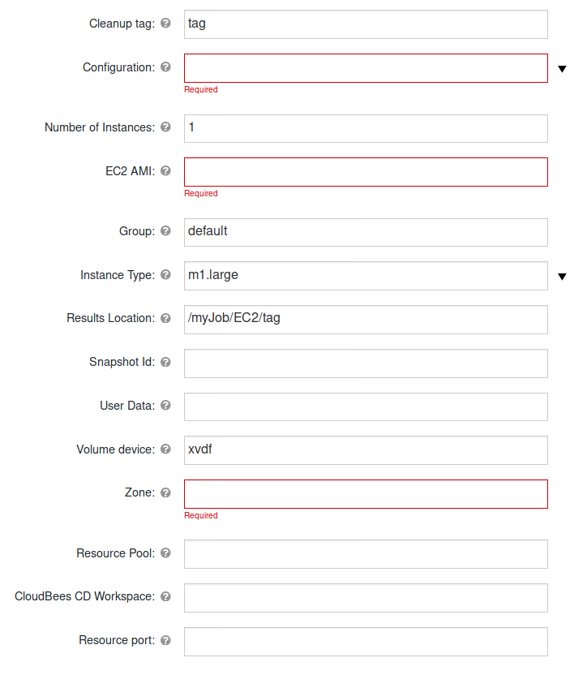

### Output

## EC2 auto pause

This procedure pauses a instance store-backed AMI. It disconnects the
volumes, saves them, and terminates the instance. It works with the EC2
Auto Resume procedure, which starts a new instance and re-attaches the
volumes.

### Input

1.  Go to the EC2 Auto Pause procedure.

2.  Enter the following parameters:

<table>
<colgroup>
<col style="width: 50%" />
<col style="width: 50%" />
</colgroup>
<thead>
<tr class="header">
<th style="text-align: left;">Parameter</th>
<th style="text-align: left;">Description</th>
</tr>
</thead>
<tbody>
<tr class="odd">
<td style="text-align: left;">
Configuration
</td>
<td style="text-align: left;">
The name of a valid existing
configuration with the connection information. (Required)
</td>
</tr>
<tr class="even">
<td style="text-align: left;">
List of Instances
</td>
<td style="text-align: left;">
The instances to terminate, which can
be a reservation, a single instance, or a list of instances.
(Required)
</td>
</tr>
<tr class="odd">
<td style="text-align: left;">
List of Volumes
</td>
<td style="text-align: left;">
The list of volumes to detach from
instances. (Required)
</td>
</tr>
</tbody>
</table>

### Output

## EC2 auto resume

This procedure restarts an instance. After the EC2 Auto Pause procedure
runs, it starts a new istance and re-attaches the saved volumes.

### Input

1.  Go to the EC2 Auto Resume procedure.

2.  Enter the following parameters:

<table>
<colgroup>
<col style="width: 50%" />
<col style="width: 50%" />
</colgroup>
<thead>
<tr class="header">
<th style="text-align: left;">Parameter</th>
<th style="text-align: left;">Description</th>
</tr>
</thead>
<tbody>
<tr class="odd">
<td style="text-align: left;">
Cleanup tag
</td>
<td style="text-align: left;">
A key used to match a cleanup step to
the corresponding provision step. This allows recursive, multiple, or
both recursive and multiple calls within a procedure. The default is
<code>tag</code>. (Required)
</td>
</tr>
<tr class="even">
<td style="text-align: left;">
Configuration
</td>
<td style="text-align: left;">
The name of a valid existing
configuration wtih the connection information. (Required)
</td>
</tr>
<tr class="odd">
<td style="text-align: left;">
Number of Instances
</td>
<td style="text-align: left;">
The number of instances to restart.
(Required)
</td>
</tr>
<tr class="even">
<td style="text-align: left;">
EC2 AMI
</td>
<td style="text-align: left;">
The name of the EC2 instance to deploy.
(Required)
</td>
</tr>
<tr class="odd">
<td style="text-align: left;">
Group
</td>
<td style="text-align: left;">
The security group to use. The default
is <code>default</code>. (Required)
</td>
</tr>
<tr class="even">
<td style="text-align: left;">
Instance Type
</td>
<td style="text-align: left;">
The instance type. The default is
<code>Large(m1.large)</code>. (Required)

<ul>
<li>
Options:
</li>
<li>
C1 High-CPU Medium (c1.medium)
</li>
<li>
C1 High-CPU Extra Large (c1.xlarge)
</li>
<li>
C3 High-CPU Double Extra Large (c3.2xlarge)
</li>
<li>
C3 High-CPU Quadruple Extra Large (c3.4xlarge)
</li>
<li>
C3 High-CPU Eight Extra Large (c3.8xlarge)
</li>
<li>
C3 High-CPU Large (c3.large)
</li>
<li>
C3 High-CPU Extra Large (c3.xlarge)
</li>
<li>
C4 High-CPU Double Extra Large (c4.2xlarge)
</li>
<li>
C4 High-CPU Quadruple Extra Large (c4.4xlarge)
</li>
<li>
C4 High-CPU Eight Extra Large (c4.8xlarge)
</li>
<li>
C4 High-CPU Large (c4.large)
</li>
<li>
C4 High-CPU Extra Large (c4.xlarge)
</li>
<li>
C5 High-CPU 18xlarge (c5.18xlarge)
</li>
<li>
C5 High-CPU Double Extra Large (c5.2xlarge)
</li>
<li>
C5 High-CPU Quadruple Extra Large (c5.4xlarge)
</li>
<li>
C5 High-CPU 9xlarge (c5.9xlarge)
</li>
<li>
C5 High-CPU Large (c5.large)
</li>
<li>
C5 High-CPU Extra Large (c5.xlarge)
</li>
<li>
C5 High-CPU 18xlarge (c5d.18xlarge)
</li>
<li>
C5 High-CPU Double Extra Large (c5d.2xlarge)
</li>
<li>
C5 High-CPU Quadruple Extra Large (c5d.4xlarge)
</li>
<li>
C5 High-CPU 9xlarge (c5d.9xlarge)
</li>
<li>
C5 High-CPU Large (c5d.large)
</li>
<li>
C5 High-CPU Extra Large (c5d.xlarge)
</li>
<li>
Cluster Compute Quadruple Extra Large (cc1.4xlarge)
</li>
<li>
Cluster Compute Eight Extra Large (cc2.8xlarge)
</li>
<li>
Cluster GPU Quadruple Extra Large (cg1.4xlarge)
</li>
<li>
High Memory Cluster Eight Extra Large (cr1.8xlarge)
</li>
<li>
D2 Double Extra Large (d2.2xlarge)
</li>
<li>
D2 Quadruple Extra Large (d2.4xlarge)
</li>
<li>
D2 Eight Extra Large (d2.8xlarge)
</li>
<li>
D2 Extra Large (d2.xlarge)
</li>
<li>
F1 16xlarge (f1.16xlarge)
</li>
<li>
F1 Double Extra Large (f1.2xlarge)
</li>
<li>
G2 Double Extra Large (g2.2xlarge)
</li>
<li>
G2 Eight Extra Large (g2.8xlarge)
</li>
<li>
G3 16xlarge (g3.16xlarge)
</li>
<li>
G3 Quadruple Extra Large (g3.4xlarge)
</li>
<li>
G3 Eight Extra Large (g3.8xlarge)
</li>
<li>
H1 16xlarge (h1.16xlarge)
</li>
<li>
H1 Double Extra Large (h1.2xlarge)
</li>
<li>
H1 Quadruple Extra Large (h1.4xlarge)
</li>
<li>
H1 Eight Extra Large (h1.8xlarge)
</li>
<li>
High I/O Quadruple Extra Large (hi1.4xlarge)
</li>
<li>
High Storage Eight Extra Large (hs1.8xlarge)
</li>
<li>
I2 Double Extra Large (i2.2xlarge)
</li>
<li>
I2 Quadruple Extra Large (i2.4xlarge)
</li>
<li>
I2 Eight Extra Large (i2.8xlarge)
</li>
<li>
I2 Extra Large (i2.xlarge)
</li>
<li>
I3 High I/O 16xlarge (i3.16xlarge)
</li>
<li>
I3 High I/O Double Extra Large (i3.2xlarge)
</li>
<li>
I3 High I/O Quadruple Extra Large (i3.4xlarge)
</li>
<li>
I3 High I/O Eight Extra Large (i3.8xlarge)
</li>
<li>
I3 High I/O Large (i3.large)
</li>
<li>
I3 High I/O Metal (i3.metal)
</li>
<li>
I3 High I/O Extra Large (i3.xlarge)
</li>
<li>
M1 General Purpose Large (m1.large)
</li>
<li>
M1 General Purpose Medium (m1.medium)
</li>
<li>
M1 General Purpose Small (m1.small)
</li>
<li>
M1 General Purpose Extra Large (m1.xlarge)
</li>
<li>
M2 High Memory Double Extra Large (m2.2xlarge)
</li>
<li>
M2 High Memory Quadruple Extra Large (m2.4xlarge)
</li>
<li>
M2 High Memory Extra Large (m2.xlarge)
</li>
<li>
M3 General Purpose Double Extra Large (m3.2xlarge)
</li>
<li>
M3 General Purpose Large (m3.large)
</li>
<li>
M3 General Purpose Medium (m3.medium)
</li>
<li>
M3 General Purpose Extra Large (m3.xlarge)
</li>
<li>
M4 General Purpose Deca Extra Large (m4.10xlarge)
</li>
<li>
M4 General Purpose 16xlarge (m4.16xlarge)
</li>
<li>
M4 General Purpose Double Extra Large (m4.2xlarge)
</li>
<li>
M4 General Purpose Quadruple Extra Large (m4.4xlarge)
</li>
<li>
M4 General Purpose Large (m4.large)
</li>
<li>
M4 General Purpose Extra Large (m4.xlarge)
</li>
<li>
M5 General Purpose 12xlarge (m5.12xlarge)
</li>
<li>
M5 General Purpose 24xlarge (m5.24xlarge)
</li>
<li>
M5 General Purpose Double Extra Large (m5.2xlarge)
</li>
<li>
M5 General Purpose Quadruple Extra Large (m5.4xlarge)
</li>
<li>
M5 General Purpose Large (m5.large)
</li>
<li>
M5 General Purpose Extra Large (m5.xlarge)
</li>
<li>
M5 General Purpose 12xlarge (m5d.12xlarge)
</li>
<li>
M5 General Purpose 24xlarge (m5d.24xlarge)
</li>
<li>
M5 General Purpose Double Extra Large (m5d.2xlarge)
</li>
<li>
M5 General Purpose Quadruple Extra Large (m5d.4xlarge)
</li>
<li>
M5 General Purpose Large (m5d.large)
</li>
<li>
M5 General Purpose Extra Large (m5d.xlarge)
</li>
<li>
General Purpose GPU 16xlarge (p2.16xlarge)
</li>
<li>
General Purpose GPU Eight Extra Large (p2.8xlarge)
</li>
<li>
General Purpose GPU Extra Large (p2.xlarge)
</li>
<li>
P3 16xlarge (p3.16xlarge)
</li>
<li>
P3 Double Extra Large (p3.2xlarge)
</li>
<li>
P3 Eight Extra Large (p3.8xlarge)
</li>
<li>
R3 High-Memory Double Extra Large (r3.2xlarge)
</li>
<li>
R3 High-Memory Quadruple Extra Large (r3.4xlarge)
</li>
<li>
R3 High-Memory Eight Extra Large (r3.8xlarge)
</li>
<li>
R3 High-Memory Large (r3.large)
</li>
<li>
R3 High-Memory Extra Large (r3.xlarge)
</li>
<li>
R4 High-Memory 16xlarge (r4.16xlarge)
</li>
<li>
R4 High-Memory Double Extra Large (r4.2xlarge)
</li>
<li>
R4 High-Memory Quadruple Extra Large (r4.4xlarge)
</li>
<li>
R4 High-Memory Eight Extra Large (r4.8xlarge)
</li>
<li>
R4 High-Memory Large (r4.large)
</li>
<li>
R4 High-Memory Extra Large (r4.xlarge)
</li>
<li>
R5 12xlarge (r5.12xlarge)
</li>
<li>
R5 16xlarge (r5.16xlarge)
</li>
<li>
R5 24xlarge (r5.24xlarge)
</li>
<li>
R5 Double Extra Large (r5.2xlarge)
</li>
<li>
R5 Quadruple Extra Large (r5.4xlarge)
</li>
<li>
R5 Eight Extra Large (r5.8xlarge)
</li>
<li>
R5 Large (r5.large)
</li>
<li>
R5 Metal (r5.metal)
</li>
<li>
R5 Extra Large (r5.xlarge)
</li>
<li>
R5D 12xlarge (r5d.12xlarge)
</li>
<li>
R5D 16xlarge (r5d.16xlarge)
</li>
<li>
R5D 24xlarge (r5d.24xlarge)
</li>
<li>
R5D Double Extra Large (r5d.2xlarge)
</li>
<li>
R5D Quadruple Extra Large (r5d.4xlarge)
</li>
<li>
R5D Eight Extra Large (r5d.8xlarge)
</li>
<li>
R5D Large (r5d.large)
</li>
<li>
R5D Metal (r5d.metal)
</li>
<li>
R5D Extra Large (r5d.xlarge)
</li>
<li>
T1 Micro (t1.micro)
</li>
<li>
T2 Double Extra Large (t2.2xlarge)
</li>
<li>
T2 Large (t2.large)
</li>
<li>
T2 Medium (t2.medium)
</li>
<li>
T2 Micro (t2.micro)
</li>
<li>
T2 Nano (t2.nano)
</li>
<li>
T2 Small (t2.small)
</li>
<li>
T2 Extra Large (t2.xlarge)
</li>
<li>
X1 Extra High-Memory 16xlarge (x1.16xlarge)
</li>
<li>
X1 Extra High-Memory 32xlarge (x1.32xlarge)
</li>
<li>
X1E 16xlarge (x1e.16xlarge)
</li>
<li>
X1E Double Extra Large (x1e.2xlarge)
</li>
<li>
X1E 32xlarge (x1e.32xlarge)
</li>
<li>
X1E Quadruple Extra Large (x1e.4xlarge)
</li>
<li>
X1E Eight Extra Large (x1e.8xlarge)
</li>
<li>
X1E Extra Large (x1e.xlarge)
</li>
<li>
Z1D 12xlarge (z1d.12xlarge)
</li>
<li>
Z1D Double Extra Large (z1d.2xlarge)
</li>
<li>
Z1D 3xlarge (z1d.3xlarge)
</li>
<li>
Z1D 6xlarge (z1d.6xlarge)
</li>
<li>
Z1D Large (z1d.large)
</li>
<li>
Z1D Extra Large (z1d.xlarge)
</li>
</ul></td>
</tr>
<tr class="odd">
<td style="text-align: left;">
Key name
</td>
<td style="text-align: left;">
The name of the key pair to use.
(Required)
</td>
</tr>
<tr class="even">
<td style="text-align: left;">
Results Location
</td>
<td style="text-align: left;">
Where to put the result. If the
location is not specified, the result is only printed. The default is
<code>/myJob/Amazon EC2</code>. (Required)
</td>
</tr>
<tr class="odd">
<td style="text-align: left;">
Volume device
</td>
<td style="text-align: left;">
The device name of a volume attached to
an instance. Examples are <code>/dev/sdf</code> in Linux and UNIX or
<code>xvdf</code> in Windows. The default is <code>xvdf</code>.
</td>
</tr>
<tr class="even">
<td style="text-align: left;">
List of Volumes
</td>
<td style="text-align: left;">
The list of volumes to attach to the
new instances. (Required)
</td>
</tr>
<tr class="odd">
<td style="text-align: left;">
Zone
</td>
<td style="text-align: left;">
The zone where the instance is created.
The default is <code>xen-cluster</code>. (Required)
</td>
</tr>
</tbody>
</table>

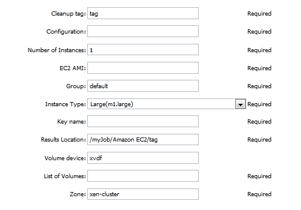

### Output

## Ec2 set name

This procedure sets an instance name.

### Input

1.  Go to the EC2 Set Name procedure.

2.  Enter the following parameters:

<table>
<colgroup>
<col style="width: 50%" />
<col style="width: 50%" />
</colgroup>
<thead>
<tr class="header">
<th style="text-align: left;">Parameter</th>
<th style="text-align: left;">Description</th>
</tr>
</thead>
<tbody>
<tr class="odd">
<td style="text-align: left;">
Configuration
</td>
<td style="text-align: left;">
The name of a valid existing
configuration wtih the connection information. (Required)
</td>
</tr>
<tr class="even">
<td style="text-align: left;">
Instance
</td>
<td style="text-align: left;">
The ID of the instance.
(Required)
</td>
</tr>
<tr class="odd">
<td style="text-align: left;">
Name
</td>
<td style="text-align: left;">
The new name of the instance.
(Required)
</td>
</tr>
</tbody>
</table>

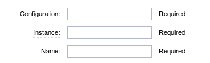

### Output

## Snap attached volume

This procedure creates a new snapshot from a volume attached to an
instance. It only creates a snapshot from the first volume found.

<table>
<colgroup>
<col style="width: 50%" />
<col style="width: 50%" />
</colgroup>
<thead>
<tr class="header">
<th style="text-align: left;">Parameter</th>
<th style="text-align: left;">Description</th>
</tr>
</thead>
<tbody>
<tr class="odd">
<td style="text-align: left;">
Configuration
</td>
<td style="text-align: left;">
The name of a valid existing
configuration with the connection information. (Required)
</td>
</tr>
<tr class="even">
<td style="text-align: left;">
Instance Id
</td>
<td style="text-align: left;">
The ID of the running EC2 instance.
(Required)
</td>
</tr>
<tr class="odd">
<td style="text-align: left;">
Results Location
</td>
<td style="text-align: left;">
Where to put the result. If the
location is not specified, the result is only printed.
(Required)
</td>
</tr>
<tr class="even">
<td style="text-align: left;">
Volume Id
</td>
<td style="text-align: left;">
The ID of the volume. If you enter a
list of volume IDs, separate the IDs with semi-colons.
(Required)
</td>
</tr>
</tbody>
</table>

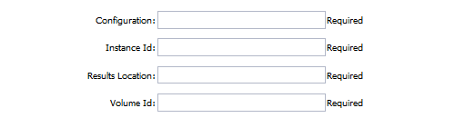

# Use cases and examples

## Use case 1: deploy, consume, and clean up the job

1.  Create a plugin configuration.

2.  Deploy an instance in EC2.

3.  Create a key pair.

4.  Run the instance.

5.  Create a new volume from an snapshot.

6.  Attach the volume to an instance.

7.  Create a resource for this instance.

8.  Run an operation using the resource.

9.  Delete the key pair.

10. Delete the resource.

11. Delete the deployed instance.

12. Delete volume.

### Create a plugin configuration

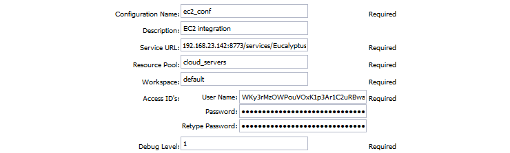

After the configuration is created, you can see it in "EC2
Configurations".

### Deploy an instance in ec2

Go to the EC2 Auto Deploy procedure, enter the values from your EC2
server in the parameter fields:

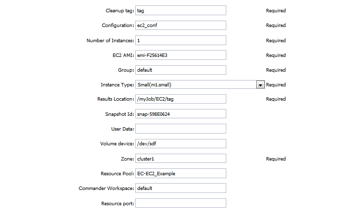

This procedure calls the API\_CreateKey, API\_RunInstances, API\_Run and
API\_AttachVolumes procedures to deploy the instance.

### Use the resource

Create a new command step for the resource. In this example, get a
resource from the resource pool and add an ec-perl **sleep** command for
30 seconds

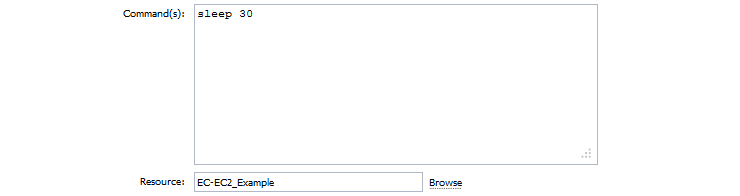

### Clean up the instance

After the resource is used, create a step using the EC2 Auto Cleanup
procedure and enter the parameters:

This procedure calls the API\_DeleteKey, API\_Terminate and
API\_DeleteVolume procedures to clean up the instance.

### View the results and output

After the job runs, you can see properties in the results location that
you specified.

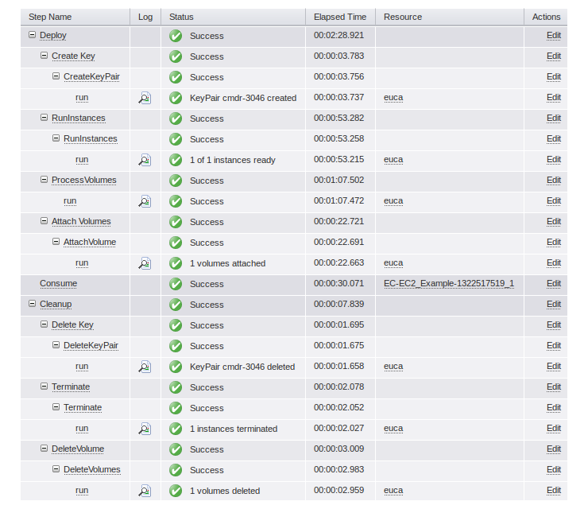

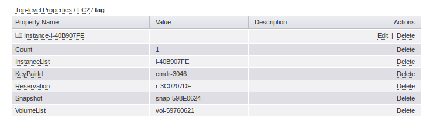

The following output appears during the Deploy procedures:

### CreateKeyPair

### RunInstances

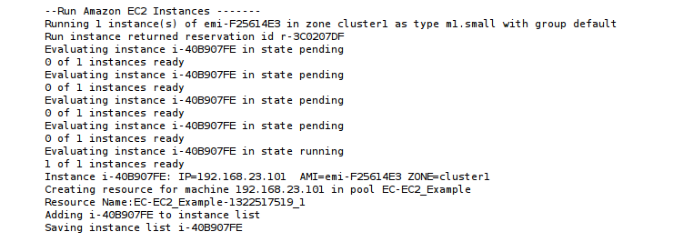

### ProcessVolumes

### AttachVolume

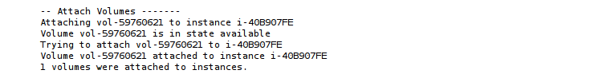

The following output appears during the Cleanup procedures:

### DeleteKeyPair

### Terminate

### DeleteVolumes

# Known issues

HTTP Proxy functionality introduced in 2.5.0 will have the following UI
limitations for customers who want to use this functionality:

* On CloudBees CD/RO (Flow) version 8.3, Proxy credentials will not appear in Resource Template UI and hence cannot be used to override what is defined already in Configuration. Other than this minor limitation, HTTP proxy will be completely functional.
* On CloudBees CD/RO (Flow) versions 8.2 and prior, Resource Template UI cannot be used to specify HTTP Proxy information and hence cannot create working Resource templates using this UI. However, the workaround for this use case would be to use DSL to create the Resource Templates.

# Release notes

## EC-EC2 2.7.3

-   The documentation has been moved to the main documentation site.

## EC-EC2 2.7.2

-   Upgrading certain third-party dependencies to address security
    issues.

## EC-EC2 2.7.1

- Renaming to "CloudBees CD/RO".

## EC-EC2 2.7.0

-   Provisioning of Binary Dependencies (for example Grape jars) in the
    agent resource, required by this plugin, is now delivered through a
    newly introduced mechanism called **Plugin Dependency Management**.
    Binary dependencies will now be seamlessly delivered to the agent
    resource from the Flow Server, any time a new version of a plugin is
    invoked the first time. Flow Repository set up is no longer required
    for this plugin.

## EC-EC2 2.6.0

-   `IAM Profile Name` parameter has been added to **API\_RunInstances**
    procedure.

## EC-EC2 2.5.4

-   Renaming "CloudBees".

## EC-EC2 2.5.3

-   Configurations can be created by users with `@` sign in a name.

## EC-EC2 2.5.2

-   Proxy credentials are now removed when configuration is deleted.

-   Logo icon has been added.

## EC-EC2 2.5.1

-   Updated list of available instances.

## EC-EC2 2.5.0

-   Support for HTTP Proxy has been provided. Customers who use HTTP
    proxy can specify Proxy Information (Host, Port and Credentials at
    the configuration level) and all procedures will use the Proxy as
    second credentials for authentication. Proxy support will address
    both use cases of Procedure Invocation:

    -   Direct Invocation

    -   Invocation through Resource Templates.

For versions prior to 8.4 there are certain limitations with Proxy
support for Resource Templates, using the Resource Template UI. Please
refer to the Known Issues Section for details.

- A new procedure called **API\_UpdateInstances** has been introduced that can be used to perform
  the following:
- Update one or more attribute values of an Instance.
- Update attribute values of multiple instances.

Note: The plugin has been packaged with new dependencies to
address the **API\_UpdateInstances** functionality. To promote the
plugin the following steps need to be taken:
1. Configure the Flow Repository Server and have it up and running.
2. If plugin is promoted using `ectoo`, and not from the platform UI, make sure that the flow
   repository server is visible to the instance from which `ectool` is
   invoked.

## EC-EC2 2.4.2

-   Configured the plugin to allow the ElectricFlow UI to create configs
    inline of procedure form.

-   Configured the plugin to allow the ElectricFlow UI to render the
    plugin procedure parameters entirely using the configured form XMLs.

-   Enabled the plugin for managing the plugin configurations in-line
    when defining an application process step or a pipeline stage task.

## EC-EC2 2.4.1

-   Default value for `Tenancy` field has been removed (this fixes a
    problem with incompatible subnetId and groupName).

- In 2.4.0 (which is part of the 8.3 Release of Electric Flow), the `Tenancy`
  field was introduced by implementing the latest version of the AWS API.
  However, this version of the plugin can error if both Security Group and
  Subnet ID are both chosen in the plugin procedures, as AWS does not
  allow specifying both of them in their newer version. The current
  version fixes this issue. The following is the behavior of the plugin
  based on the value chosen for the `Tenancy` field in conjunction with
  Subnet ID and Security Group:

    - `no value chosen`: Subnet ID and Security Group can be both chosen.

    - `default`: Security Group and Subnet ID are both optional. If they are
      used only one of them can be specified.

    - `dedicated`: Subnet ID is mandatory. Security Group is optional. Only one
      of them can be specified.

    - `host`: Subnet ID is mandatory. Security Group is optional. Only one of
      them can be specified.

## EC-EC2 2.4.0

-   `Tenancy` parameter has been added to **RunInstances** procedure.

## EC-EC2 2.3.5

-   Support of AWS Signature Version 4 has been added.

## EC-EC2 2.3.4

-   Added the ability to create a resource in non-default zone.

-   Added validation to the **CreateConfiguration** procedure for the
    dynamic environments feature.

-   Make *instances* parameter optional for **API\_DescribeInstances**
    procedure.

-   Added check for instances and subnet’s IP limits before spinning
    instances in **API\_RunInstances** procedure, minor changes.

-   Make `resource\_zone` parameter optional with default value *default*
    in **API\_RunInstances**.

## EC-EC2 2.3.3

-   Fixed issue with configurations being cached for Internet Explorer(R).

## EC-EC2 2.3.2

-   Added **API\_CreateVPC** procedure.

-   Added **API\_CreateSubnet** procedure.

-   Added **API\_DeleteVPC** procedure.

-   Added **Private IP** and **Instance Initiated Shutdown Behaviour**
    parameters to **API\_RunInstance** procedure.

-   Modified of **API\_Terminate procedure**. Changed the behaviour of the
    procedure to wait till all instances get terminated in
    `reservation/instance` list.

## EC-EC2 2.3.1

-   Fixed the issue where the **API\_CreateTags** procedure is visible from
    step picker. Default value for tag was set as `Name`.

-   Added properties in the `ec\_cloudprovisioning\_plugin` property
    sheet for ElectricFlow Deploy.

-   Propagated the summary property to the upper level.

-   Add VPC support to the **API\_RunInstances** procedures.

-   Updated the Configuration page UI.

-   Removed Eucalyptus support from the plugin.

## EC-EC2 2.2.0

## EC-EC2 2.2.0

-   Fixed the Secret access key in the log.

-   Changed the Configuration Management procedure.

-   Added a new parameter called **Attempt Connection?** in the
    CreateConfiguration procedure.

-   Added a step called **AttemptConnection** in the **CreateConfiguration**
    procedure.

## EC-EC2 2.1.2

-   Changed the procedure names in the step picker list.

## EC-EC2 2.0.7

-   Fixed the plugin configuration descriptions in the Help page.

-   Changed the Eucalyptus tool description.

## EC-EC2 2.0.6

-   Fixed the problem with attached credentials.

## EC-EC2 2.0.5

-   Fixed the **DescribeInstances** procedure (it returned fake data when
    non-existent instance was specified).

## EC-EC2 2.0.4

-   Fixed the system test and **API\_DeleteVolume** procedures.

## EC-EC2 2.0.3

-   Improved the error handling.

## EC-EC2 2.0.2

-   Removed the CloudManagerGrow and CloudManagerShrink procedures from
    step picker.

-   Changed the style of the Help page.

## EC-EC2 2.0.1

-   Added a link to each procedure.

-   Cleaned up the parameter panel XML file.

## EC-EC2 2.0.0

-   Applied the new Help page template.

-   Added a detailed use case.

-   Added the new XML parameter panel to all procedures.

-   Fixed image parameter label on the API\_RunInstances procedure.

## EC-EC2 1.2.1

-   Updated the Help page.
